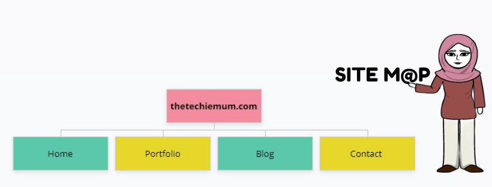
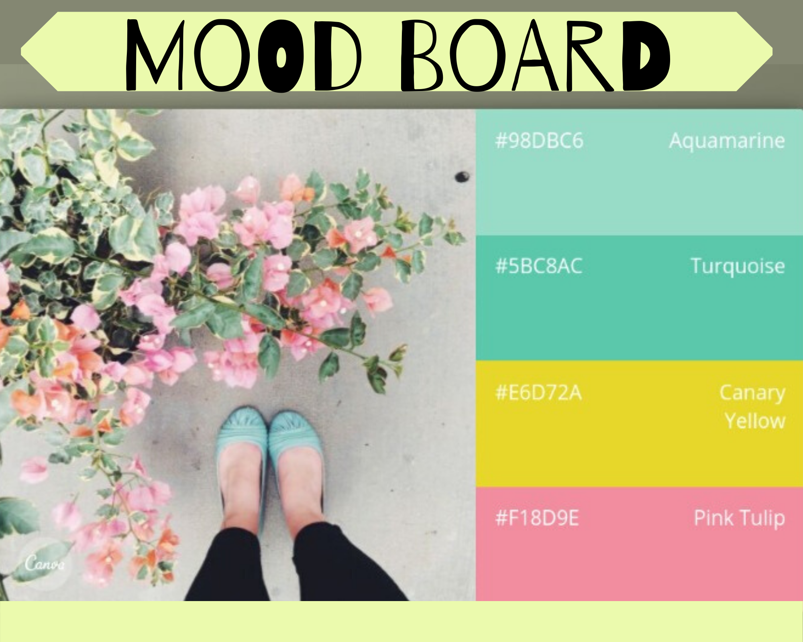
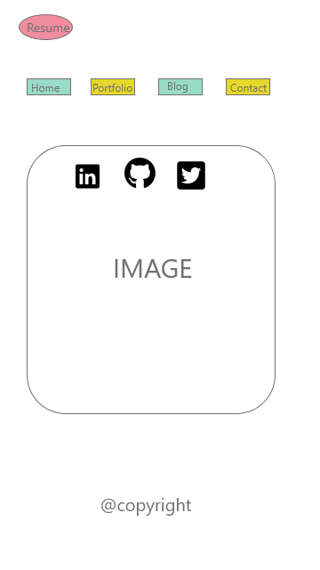
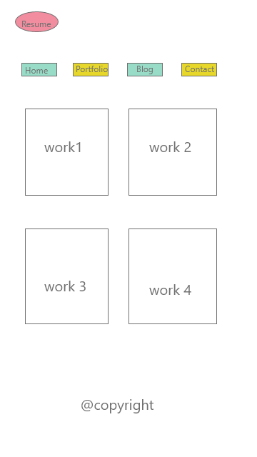
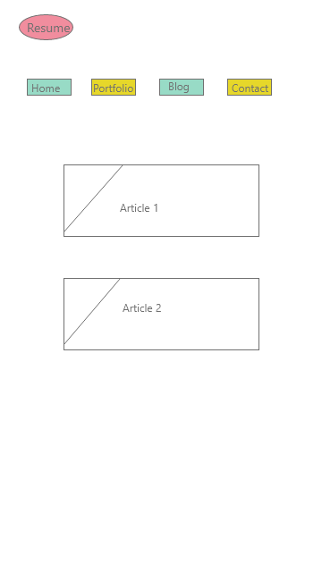
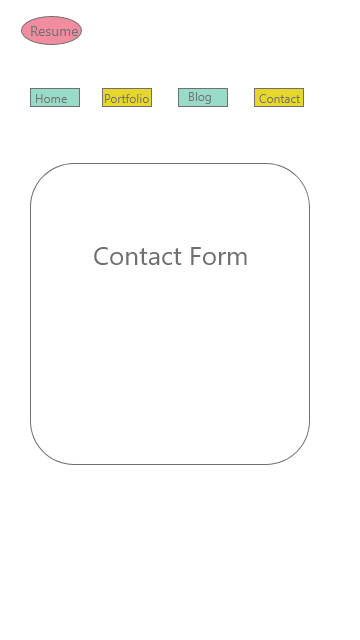
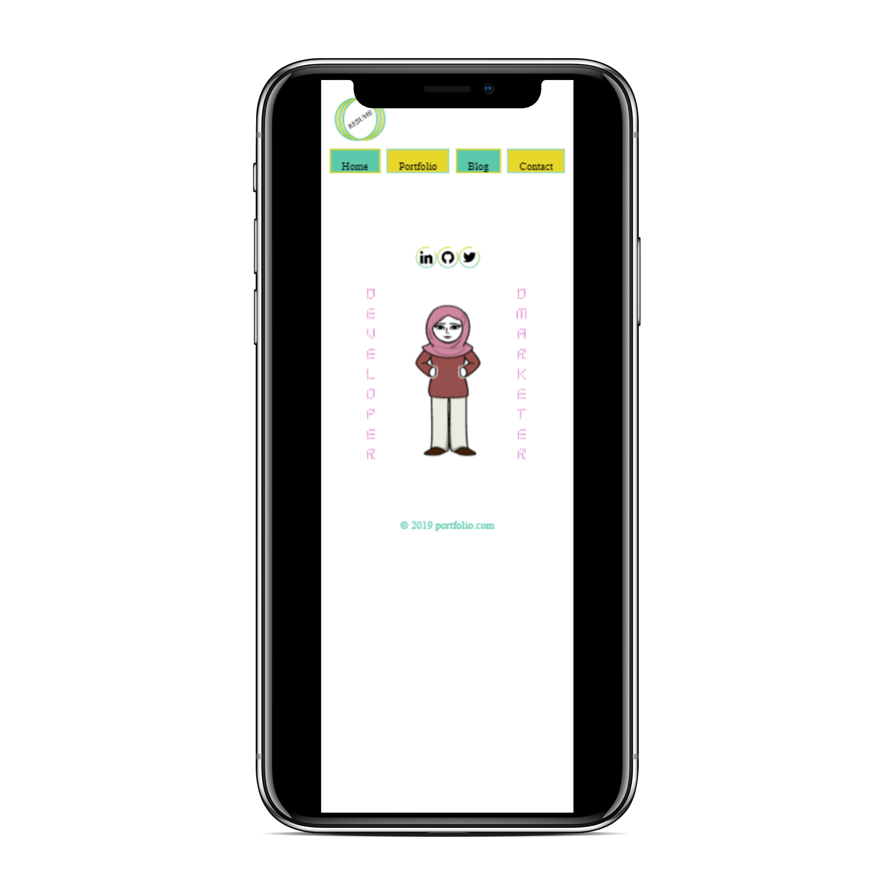
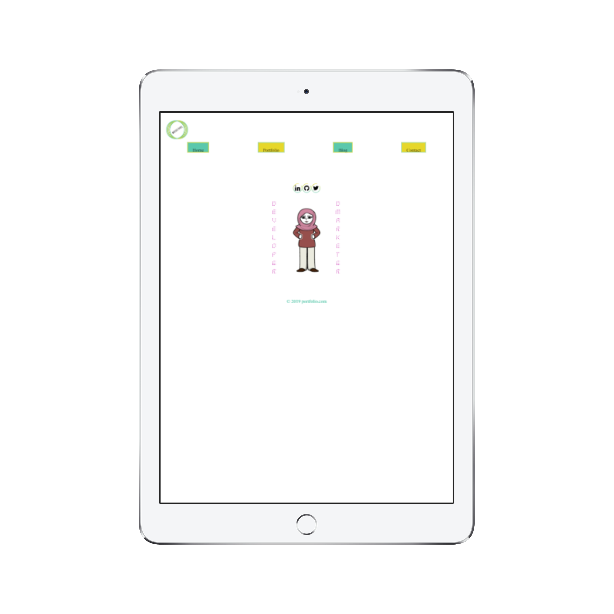

# Portfolio_T1A3

## Links

## *Published portfolio website : 
## *Github repository : https://github.com/techiemum/portfolio_T1A3
## *Trelloboard link : https://trello.com/b/SRythb1A/portfoliot1a3

## Description of portfolio website

## *Purpose* :

I created this website to showcase my skills and information about myself.
It also reflects my ideas , user interaction and methods a website should use.
This also features my work , resume to potential employers.

## *Functionality / features* :

The Components of this website are:

#### + Image with Functionality : 

Along with creating logo image i added downloadable pdf file attach to
logo which would display through out the website.

#### + Navigation Bar :

Interactive navigation bar which change style and shape after hover/click
over it. It's throughout maintained with same theme style for all pages.

#### + Social links :

Three main social network links has been displayed on home page. It has logo
image of social media network. Links became enlarge when hovering the mouse.

#### + Flip image :

While hovering towards social media links main image flip to second image
mentioning let's connect .This is indirect sign to divert user towards connection
with social media.

#### + Portfolio showcase :

Created card style images for portfolio page. It show each work individually
and every box has a shadow and enlarge on hover effects.

#### + Blog articles :

Separate image flip effect when hovering on article . Box has shadow effect and image with
basic details of author. 

##### + Contact form :

Interactive contact form which asks for name ,email and message to reach to me.
Also, it will authenticate whether person who is filling up details is human or bot.

## *Target audience* :

* Potential employers
* Colleagues
* Professional Collaborators

## *Sitemap* :

Home page has resume (pdf version) download link along with social network links.
Main navigation leads to index , portfolio , blog and contact me page

## *Screenshots* :

## *Responsive design* :

## *Created with* :

* HTML 
* Scss 

